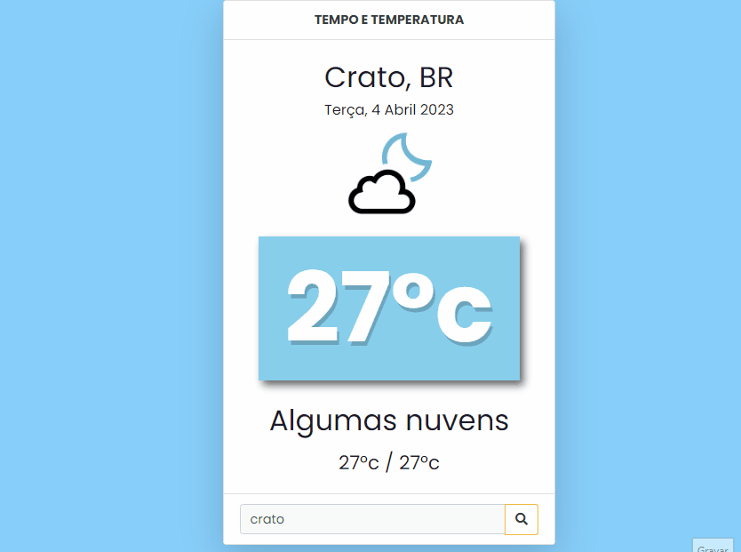

## 🧾 Descrição

Este projeto é uma página web que exibe o tempo e a temperatura de uma determinada cidade. Ele utiliza a biblioteca Bootstrap para estilos e inclui um campo de entrada de texto para que o usuário possa digitar o nome da cidade que deseja pesquisar. A página exibe a temperatura atual, a previsão do tempo, a temperatura mínima e máxima, além de uma imagem ilustrativa do clima.

<h1>

## 🔌 Tecnologias utilizadas

- **HTML:** linguagem de marcação usada para estruturar e apresentar o conteúdo da página;
- **JavaScript:** Linguagem de programação que permite criar interações dinâmicas na web. Com ela é possível manipular o conteúdo HTML e CSS em tempo real, validar formulários, criar animações, entre outras possibilidades.
- **CSS:** Contém regras de estilo que são usadas para personalizar a aparência da página HTML. Ele inclui configurações de fonte, cor de fundo, posicionamento e tamanho de elementos, e outras propriedades de estilo para tornar a página mais atraente e fácil de usar.
- **API Weather:** A API Weather é um serviço que fornece dados meteorológicos em tempo real e previsões do tempo para locais específicos em todo o mundo.

## ⚙️ Estrutura

- **img:** Contém imagens utilizadas no projeto e para apresentação no Readme.md;
- **index.html:** Contém a linguagem de marcação(index.html) usada para estruturar e apresentar o conteúdo da página.
- **style.css:** Estilização da página, com configurações de fonte, cor de fundo, posicionamento e tamanho de elementos.
- **script.js:** Ele define a chave da API, URL base, idioma e unidades de medida padrão. Também seleciona os elementos HTML da página que serão atualizados com os dados da API. Quando a página carrega, a função é executada para obter a posição do usuário, e obtém os resultados da API com base nas coordenadas do usuário.

## 🏳️ Como executar?

### **Passo 1**
Faça download do repositório

### **Passo 2**
Abra o arquivo "Index.html" em um navegador e teste as funções.

 

## ✅ Resultado (Preview)

### **CLIMA**

 

## 💻 Autor: Luan Ferreira

Portfólio:
- [Github](https://github.com/fluanbrito)

Contato:
- [Linkedin](https://www.linkedin.com/in/luanferreirab/)

<h1>

## 🚀 Sobre mim
Sou um grande entusiasta e apaixonado por tecnologia, empreendedorismo e inovação. Hoje, estou a cursar o curso de Sistema de Informação pelo Instituto Federal, faço uso profissionalmente de ferramentas e me aprofundo em temas como Marketing, Machine Learning AWS, Metodologias ágeis, Gestão de Projetos, Programação Web, Administração de Sistemas, Redes de computadores, entre outros.